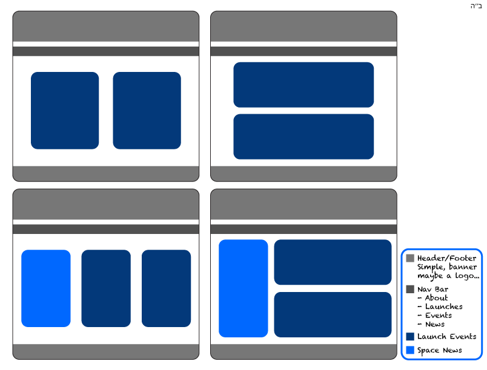

Asher / 08/10/2020 

(DISCLAIMER : the following information is subject to change based on developing phases and dev. brain capacity. )

## Proposal

### What is your project?

A space events/launch app, with possible expansion to space related news.

### Wireframes!

### Initial thoughts on app structure

- Seeding a database with API info (still figuring out how to).
- Show in an intuitive way the info scouted.
- Easy to use inviting design.
- If time permits a space news row.
- Auth if brain doesn't fries.
- Deployment to heroku is obscure.

### Phases of Completion

- Info scouting.
- Peeling the onion of the api's.
- File Structure development.
- db[migrations and seeds] -> Server -> routes -> controllers -> views -> initial styling
- Styling.

### Links and Resources

- RSO
- https://thespacedevs.com/
- https://thespacedevs.com/llapi
- https://thespacedevs.com/snapi
- CSS + HTML / JS and Jquery books.
- The Google and it's capacity to develop our Googliness.
- BH brain capacity, time management, and a shton of GIFD.
